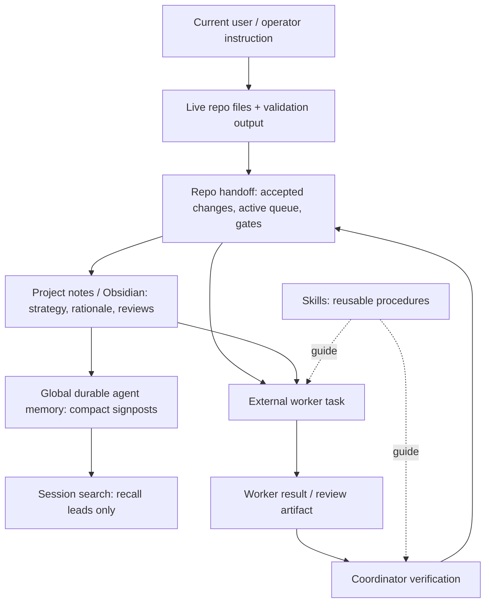

# Architecture

This project models memory governance as separate authority layers. The goal is not to maximize how much an agent remembers. The goal is to make it clear what the agent may treat as current project truth.

Every important fact should have one authoritative home. Other layers may point to it or help recover it, but lower-authority memory must not silently override current instructions, live files, or verified project state. The layers are intentionally redundant enough that a future agent can recover context, but not so redundant that stale facts spread across every memory store.

## Layer contract

The diagram is also a conflict-resolution order: when two layers disagree, the higher layer wins until the lower claim is re-verified against current state. Skills are intentionally outside the order because they define reusable procedures rather than project facts.

| Layer | Question it answers | Update cadence |
|---|---|---|
| Current instruction | What did the human ask now? | Each session/task |
| Live repo/files | What is actually true on disk? | Every verification |
| Repo handoff | What changed, what was verified, what is blocked? | After accepted work/reviews |
| Active queue | What is the current lane and next safe action? | After phase/priority changes |
| Project notes | Why are we doing this and what decisions matter long-term? | After durable strategy/rationale changes |
| Global memory | Where should future sessions look first? | Rare, compact updates |
| Skills | How should repeatable work be performed? | After reusable workflow lessons |

## Worker context boundary

External workers receive only what their wrapper/prompt includes plus what they choose to read from disk. A mature project therefore names required context reads in every worker task instead of assuming that global memory, chat history, or the full note vault is inherited.
