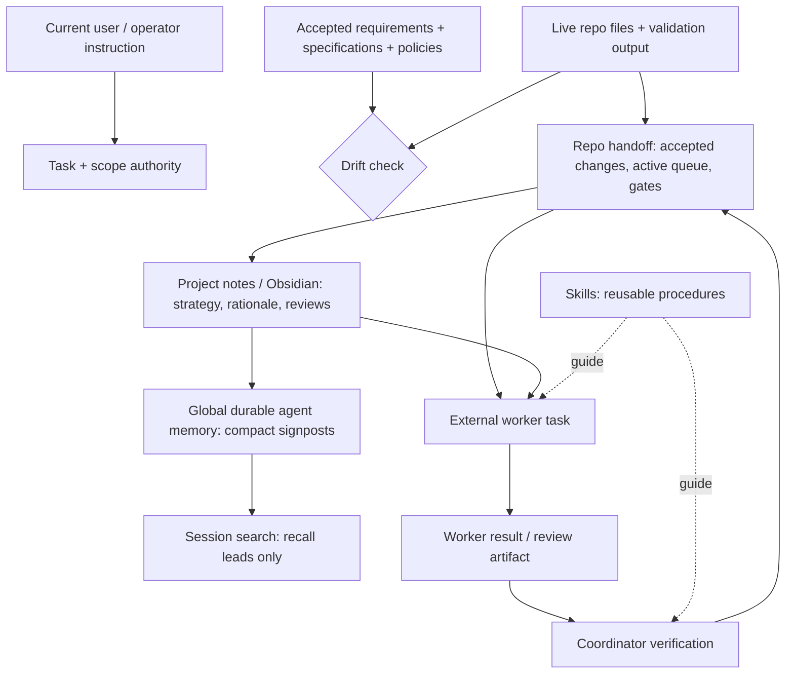

# Architecture

This project models memory governance as a thin authority overlay between existing context systems. The goal is not to maximize how much an agent remembers or to replace the tools that store instructions, specifications, handoffs, notes, or memory. The goal is to make their scopes and seams explicit.

Every important fact should have one authoritative home. Other layers may point to it or help recover it, but lower-authority memory must not silently override current instructions, live files, or verified project state. MPMG itself should remain a map and boundary contract, not become another database that duplicates those facts.

## Layer contract

Authority depends on the question. Current user/operator instruction controls task and scope, but does not rewrite observed facts. For **current observed state**, live files, configuration, and fresh validation evidence outrank handoff, notes, memory, and old sessions until lower claims are re-verified. Skills are intentionally outside the order because they define reusable procedures rather than project facts.

For questions about **intended behavior**, accepted specifications and policies form a separate normative authority. A mismatch between specification and implementation is drift to resolve, not proof that either side should be silently discarded. The project must identify the owner and decide which artifact changes.

| Layer | Question it answers | Update cadence |
|---|---|---|
| Current instruction | What task and scope did the human authorize now? | Each session/task |
| Live repo/files | What is actually true on disk? | Every verification |
| Accepted specifications/policies | What is the system intended or required to do? | After an approved requirement/policy change |
| Repo handoff | What changed, what was verified, what is blocked? | After accepted work/reviews |
| Active queue | What is the current lane and next safe action? | After phase/priority changes |
| Project notes | Why are we doing this and what decisions matter long-term? | After durable strategy/rationale changes |
| Global memory | Where should future sessions look first? | Rare, compact updates |
| Skills | How should repeatable work be performed? | After reusable workflow lessons |

## Worker context boundary

External workers receive only what their wrapper/prompt includes plus what they choose to read from disk. A mature project therefore names required context reads in every worker task instead of assuming that global memory, chat history, or the full note vault is inherited.

## Overlay boundary

MPMG may detect or point to `AGENTS.md`, `CLAUDE.md`, scoped rules, Cline-style memory, Sopify, Spec Kit, OpenSpec, Ruler, handoff directories, and project notes. It does not merge them, rewrite them, or infer their semantic correctness. Runtime enforcement remains the responsibility of hooks, permissions, approvals, and policy engines.
